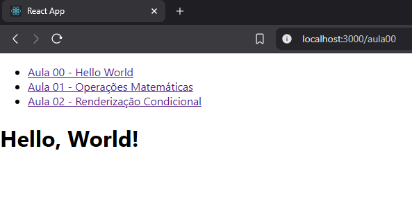
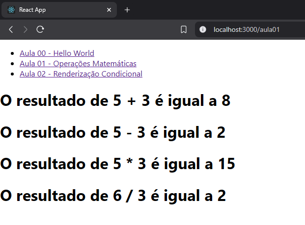
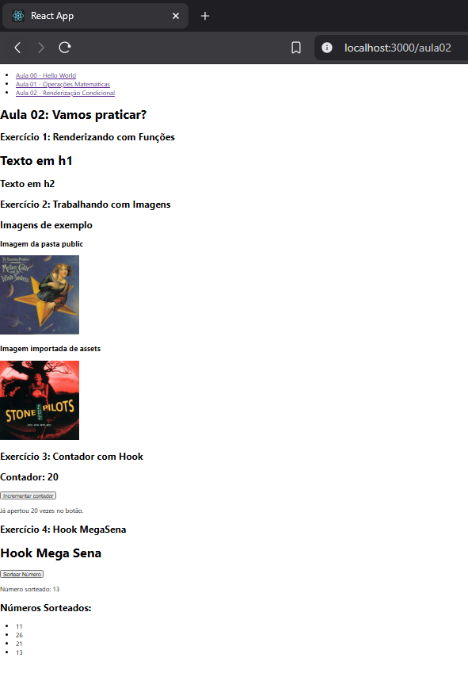
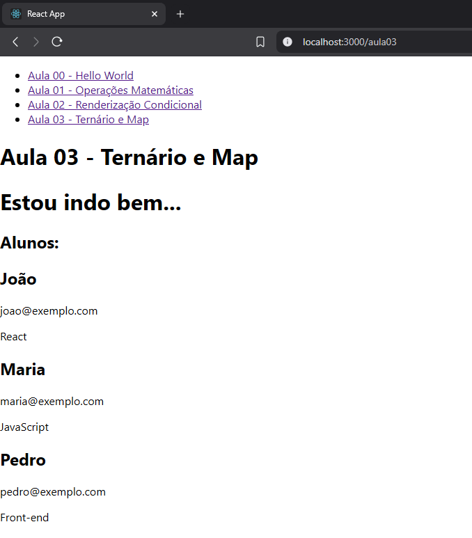
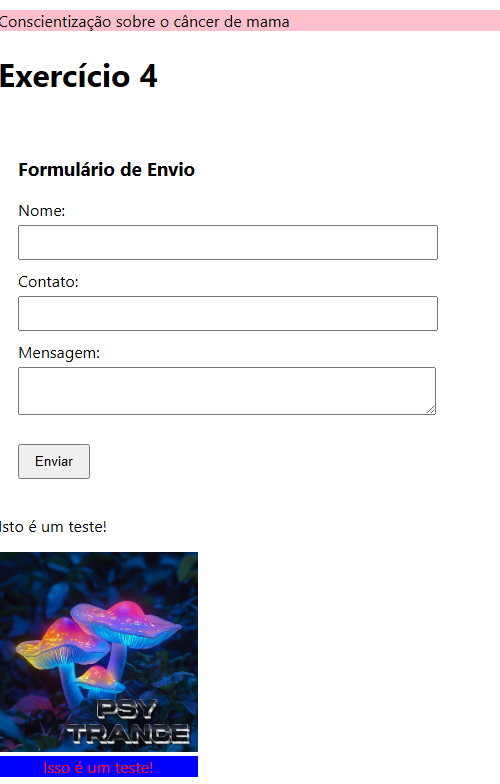
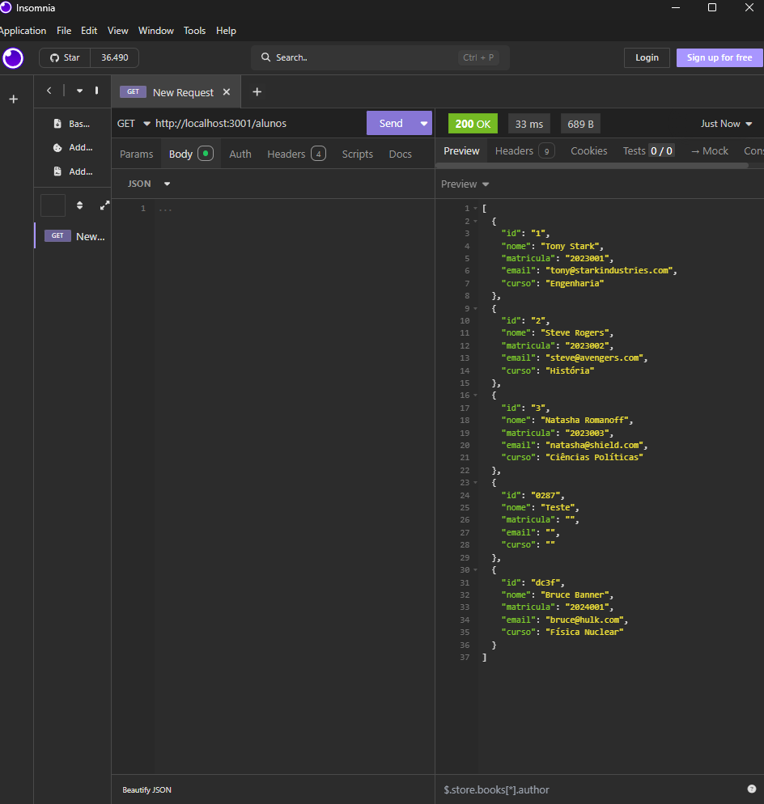
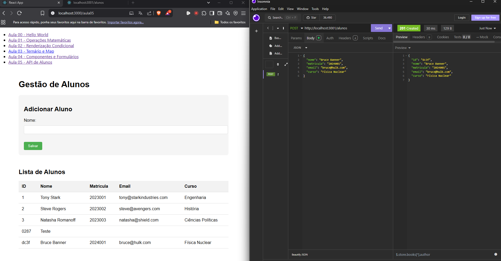

# 🎓 React UNIESP - Aulas

Este repositório contém as atividades realizadas nas aulas de React para o curso da UNIESP. Cada aula inclui exercícios práticos de aprendizado sobre os conceitos fundamentais do React, como componentes, renderização condicional, hooks, entre outros.

---

## 🖥️ Aula 00 - Hello World

**Objetivo**: Criar um componente simples que exibe "Hello, World!" na tela.

### Resultado



---

## ➕ Aula 01 - Operações Matemáticas

**Objetivo**: Criar operações matemáticas (adição, subtração, multiplicação e divisão) com inputs dinâmicos e renderizar os resultados.

### Resultado



---

## 🔄 Aula 02 - Renderização Condicional

**Objetivo**: Trabalhar com renderização condicional usando o hook `useState` e outros conceitos de React.

### 🧮 Exercício 1: Contador

**Objetivo**: Criar um contador que pode ser incrementado por um botão.

### Resultado



### 🎰 Exercício 2: Mega Sena

**Objetivo**: Criar um sorteio de números aleatórios, simulando um sorteio da Mega Sena com a limitação de sorteio de 6 números.

### Resultado


---

## 🧑‍🏫 Aula 03 - Ternário e Map

**Objetivo**: Trabalhar com o operador ternário e renderizar uma lista de alunos utilizando o método `map`.

### 🧐 Exercício 1: Verificando se está indo bem

**Objetivo**: Usar o operador ternário para exibir uma mensagem condicional com base em uma propriedade `estouConseguindo`.

### Resultado



### 👨‍🎓 Exercício 2: Renderizando Alunos

**Objetivo**: Renderizar informações sobre alunos utilizando a técnica de destructuring e o método `map` para percorrer um array de objetos.

### Resultado


## Aula 04 - Formulário de Contato Component

### Objetivo
Implementar um componente de formulário funcional em React que coleta e processa dados de contato.

### Requisitos
1. Criar o componente `FormularioDeContato`
2. Campos obrigatórios:
   - Nome (texto)
   - Contato (texto)
   - Mensagem (textarea)
3. Funcionalidades:
   - Gerenciamento de estado dos campos
   - Conversão para JSON ao submeter
   - Log no console da saída JSON

   ### Resultado



## Aula 05 - API Fake e CRUD de Alunos

### Objetivo
Implementar um sistema completo de gerenciamento de alunos com API fake e interface React para operações CRUD.

### Funcionalidades

# Componente TabelaAlunos

- Exibe lista de alunos em formato tabular
- Permite edição e exclusão
- Atualização em tempo real

# Componente FormAluno

- Submissão assíncrona
- Feedback visual

# Componente Principal Aula05

- Gerencia estado global
- Integra tabela e formulário


   ### Resultado






---

## 🚀 Como Rodar o Projeto

1. Clone o repositório:

   ```bash
   git clone https://github.com/seu-usuario/aulas-react.git
   ```

2. Entre na pasta do projeto:

   ```bash
   cd aulas-react
   ```

3. Instale as dependências:

   ```bash
   npm install
   ```

4. Inicie o servidor de desenvolvimento:

   ```bash
   npm start
   ```

Isso iniciará o servidor de desenvolvimento e abrirá o projeto em `http://localhost:3000`.

---
